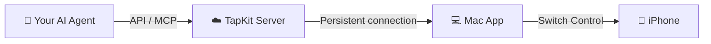
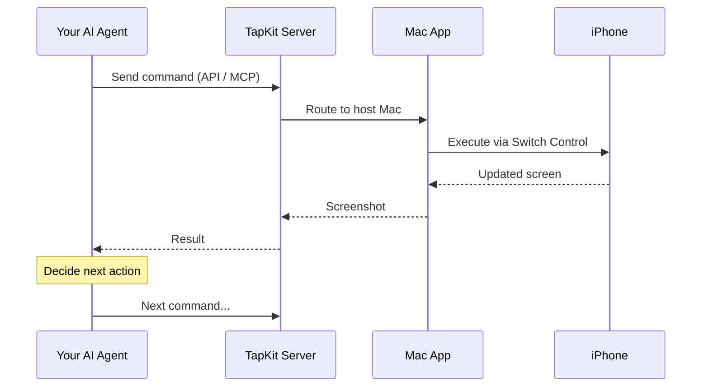

## The three layers

TapKit has three pieces that work together: your **iPhone**, the **Mac app**, and the **TapKit server**.

### The Mac app is the host

The Mac app runs on a Mac that's physically connected to your iPhone via USB and on the same Wi-Fi network. It uses Apple's built-in Switch Control accessibility feature to see the phone's screen and send taps, swipes, and keystrokes — the same way a human would interact with it. The Mac is the only thing that talks directly to the phone.

### The server connects everything

The Mac app maintains a persistent connection to the TapKit server. When an AI agent sends a command through the API — "tap at (200, 400)" or "take a screenshot" — the server routes it to the right Mac, which executes it on the right phone. The server also handles authentication, session management, and screen streaming.

### Your agent calls the API

Any tool that can make HTTP requests or connect to an MCP server can control the phone. Claude, Codex, your own scripts — they all talk to the TapKit API, never directly to the Mac or the phone. This means your agent doesn't need to be on the same network, or even the same continent, as the device it's controlling.

## Why this architecture?

- **No jailbreak, no sideloading, no developer mode.** Switch Control is a first-party Apple feature. Nothing is installed on the iPhone.
- **Works with any app.** Because control happens at the OS level, your agent can operate any app — including ones that block automation frameworks.
- **Remote by default.** The API layer means your agent can be anywhere. The Mac and phone can be in a closet, a data center, or on your desk.

## What happens when you run a task

1. Your agent sends a command to the TapKit API (or MCP server).
2. The server authenticates the request and routes it to the Mac that's hosting the target phone.
3. The Mac app executes the action on the phone via Switch Control.
4. The Mac captures the updated screen and sends it back through the server.
5. Your agent sees the result and decides what to do next.

This loop repeats until the task is done — your agent looks, acts, and reacts just like a person would.
