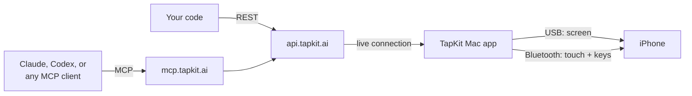

TapKit has three parts: your iPhone, the TapKit Mac app, and the TapKit cloud.

## The Mac controls the iPhone

The iPhone stays plugged into the Mac with a USB cable. The Mac app talks to it in two ways.

**Screen over USB.** The Mac receives the iPhone's screen over the cable, the same way QuickTime records an iPhone. macOS treats the iPhone's screen as a camera, so TapKit asks for Camera access.

**Touch and keyboard over Bluetooth.** The iPhone pairs with the Mac, and the Mac acts as a Bluetooth mouse and keyboard. AssistiveTouch, an iOS accessibility feature, turns the mouse input into taps, drags, and flicks. TapKit asks for Bluetooth access for this.

TapKit only uses features built into iOS, so nothing is installed on the iPhone. To disconnect a phone, unplug it or forget the Mac in **Settings > Bluetooth**.

## Agents reach the Mac through the cloud

While you're signed in, the Mac app keeps a connection open to the TapKit cloud. Agents that don't run on the Mac send commands to the cloud, and the cloud forwards each command to the Mac that the target phone is plugged into.

```mermaid
flowchart LR
    A[Claude, Codex, or<br/>any MCP client] -->|MCP| M[mcp.tapkit.ai]
    C[Your code] -->|REST| S[api.tapkit.ai]
    M --> S
    S -->|live connection| Mac[TapKit Mac app]
    Mac -->|USB: screen| P[iPhone]
    Mac -->|Bluetooth: touch + keys| P
```

The built-in agent in the Mac app reads the screen and sends input on the Mac itself. It only uses the network to call a hosted language model.

## The agent loop

Every TapKit agent works in a loop. It takes a screenshot, decides what to do, then taps, flicks, types, or presses a key. Then it takes another screenshot to check the result, and repeats until the task is done.

Agents work from screenshots and pixel coordinates, not an accessibility tree. Any app you can use by hand works with TapKit.

## When a phone is ready

A phone works with TapKit when the Mac app is open and signed in, and the iPhone is plugged in, trusted, and unlocked. The iPhone also has to be paired with the Mac over Bluetooth with AssistiveTouch on, which the Mac app sets up for you. Finally, the phone has to be active on your TapKit subscription. If a phone isn't ready, it shows as offline. See [Setup](/setup#troubleshooting).
