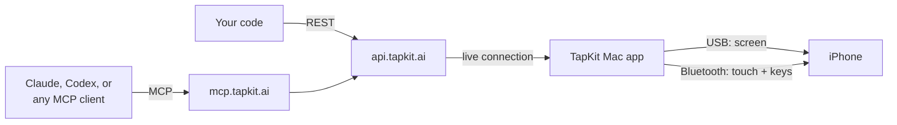

TapKit has three parts: your **iPhone**, the **TapKit Mac app**, and the **TapKit cloud**.

## The Mac drives the iPhone

The iPhone stays plugged into the Mac with a USB cable. The Mac app uses two connections to it:

- **Screen (USB).** The Mac receives the iPhone's screen over the cable, the same way QuickTime can record an iPhone. This is why TapKit asks for Camera access on the Mac.
- **Touch and keyboard (Bluetooth).** The iPhone pairs with the Mac as a Bluetooth mouse and keyboard. iOS's AssistiveTouch turns the mouse input into taps, drags, and flicks. This is why TapKit asks for Bluetooth access.

TapKit uses only features built into iOS. Nothing is installed on the iPhone, and you can disconnect it at any time by unplugging it or unpairing it in **Settings > Bluetooth**.

## Agents reach the Mac through the cloud

The Mac app keeps a connection open to the TapKit cloud while you're signed in. Agents that don't run on the Mac send commands to the cloud, which forwards them to the Mac hosting the target phone.

```mermaid
flowchart LR
    A[Claude, Codex, or<br/>any MCP client] -->|MCP| M[mcp.tapkit.ai]
    C[Your code] -->|REST| S[api.tapkit.ai]
    M --> S
    S -->|live connection| Mac[TapKit Mac app]
    Mac -->|USB: screen| P[iPhone]
    Mac -->|Bluetooth: touch + keys| P
```

The built-in agent in the Mac app skips the cloud relay for phone control: it reads the screen and sends input locally, and only calls out to a hosted language model.

## The agent loop

Every TapKit agent works the same way:

1. Take a screenshot.
2. Decide what to do from what's on screen.
3. Tap, flick, type, or press a key.
4. Take another screenshot to check the result.

There is no accessibility tree or DOM — agents work from pixels and coordinates, so any app you can use by hand works with TapKit.

## What has to be true for a phone to work

- The Mac app is open and signed in.
- The iPhone is connected over USB, trusted, and unlocked.
- The iPhone is paired with the Mac over Bluetooth, and AssistiveTouch is on. The Mac app sets this up for you.
- The phone is active on your TapKit subscription.

If any of these break, the phone shows up as offline or not ready. See [Setup](/setup#troubleshooting).
