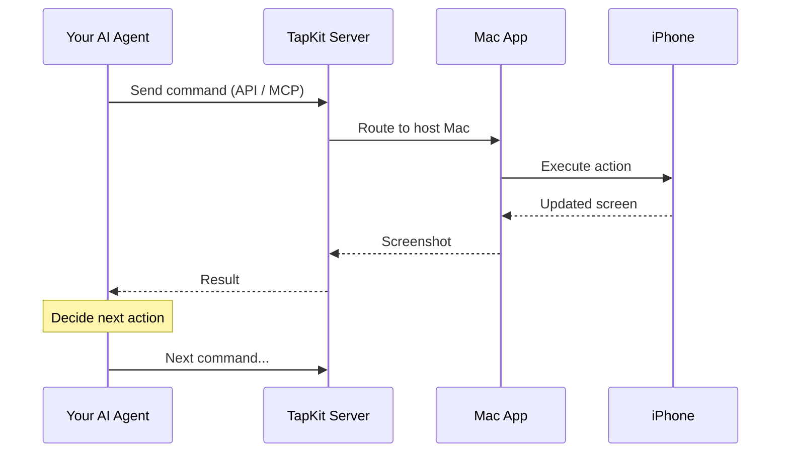

TapKit has three parts: your iPhone, the TapKit Mac app, and the TapKit cloud.

## The Mac hosts the iPhone

The iPhone stays plugged into a Mac running the TapKit app. The Mac app is the only part of TapKit that talks to the phone. It sees the phone's screen and carries out taps, flicks, typing, and key presses on it.

To disconnect a phone, unplug it or quit the Mac app.

## Agents reach the Mac through the cloud

While you're signed in, the Mac app keeps a connection open to the TapKit cloud. Claude, Codex, and your own code send commands to the cloud through [MCP](/integrations/mcp) or the [REST API](/api-reference/introduction). The cloud forwards each command to the Mac that the target phone is plugged into, and sends the result back.

The built-in agent in the Mac app works with the phone directly and only uses the network to call a hosted language model.

## Why this architecture?

- **No jailbreak, no sideloading, no developer mode.** Nothing is installed on the iPhone.
- **Works with any app.** TapKit interacts with the phone through the same visible interface a person uses, rather than relying on app-specific integrations.
- **Remote by default.** The API layer means your agent can be anywhere. The Mac and phone can be in a closet, a data center, or on your desk.

## What happens when you run a task

```mermaid
sequenceDiagram
    participant Agent as Your AI Agent
    participant Server as TapKit Server
    participant Mac as Mac App
    participant Phone as iPhone

    Agent->>Server: Send command (API / MCP)
    Server->>Mac: Route to host Mac
    Mac->>Phone: Execute action
    Phone-->>Mac: Updated screen
    Mac-->>Server: Screenshot
    Server-->>Agent: Result
    Note over Agent: Decide next action
    Agent->>Server: Next command...
```

Every TapKit agent works in a loop. It takes a screenshot, decides what to do, then taps, flicks, types, or presses a key. Then it takes another screenshot to check the result, and repeats until the task is done.

## When a phone is ready

A phone works with TapKit when the Mac app is open and signed in, the iPhone is plugged in and unlocked, and you've finished [setup](/setup) for it in the Mac app. The phone also has to be active on your TapKit subscription. If a phone isn't ready, it shows as offline. See [Setup](/setup#troubleshooting).
